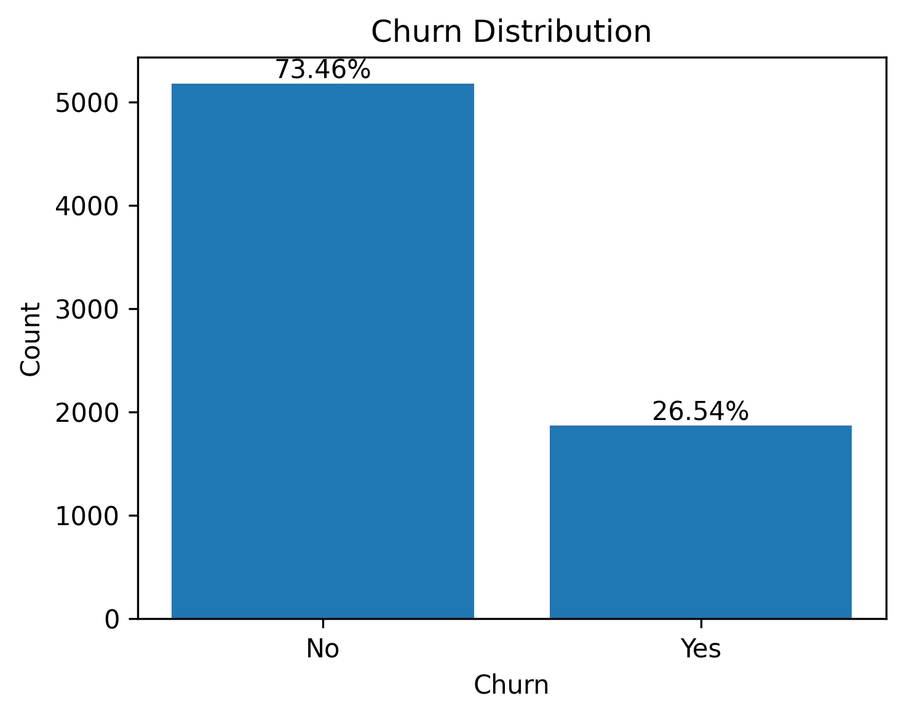
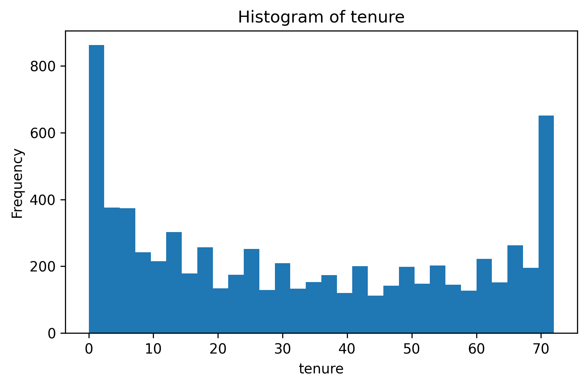
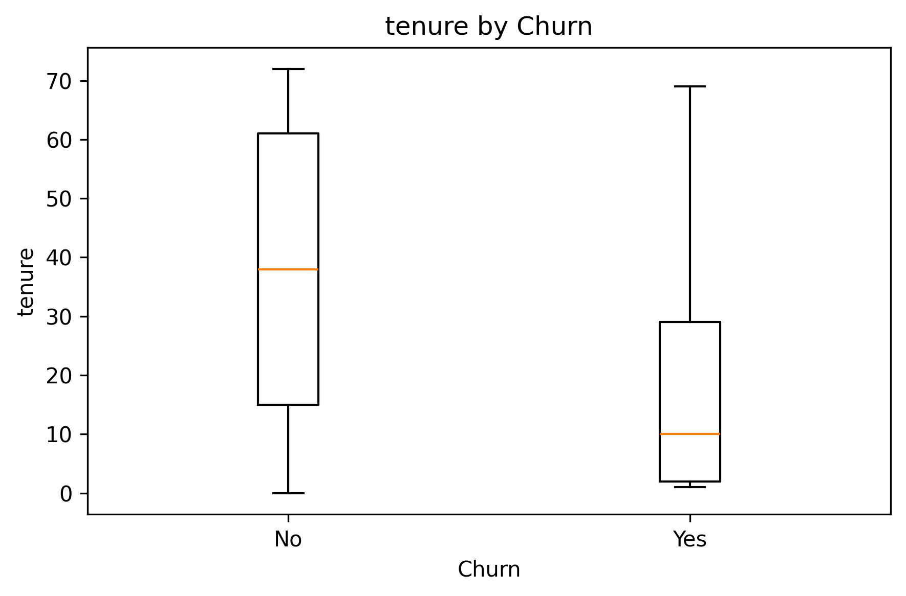
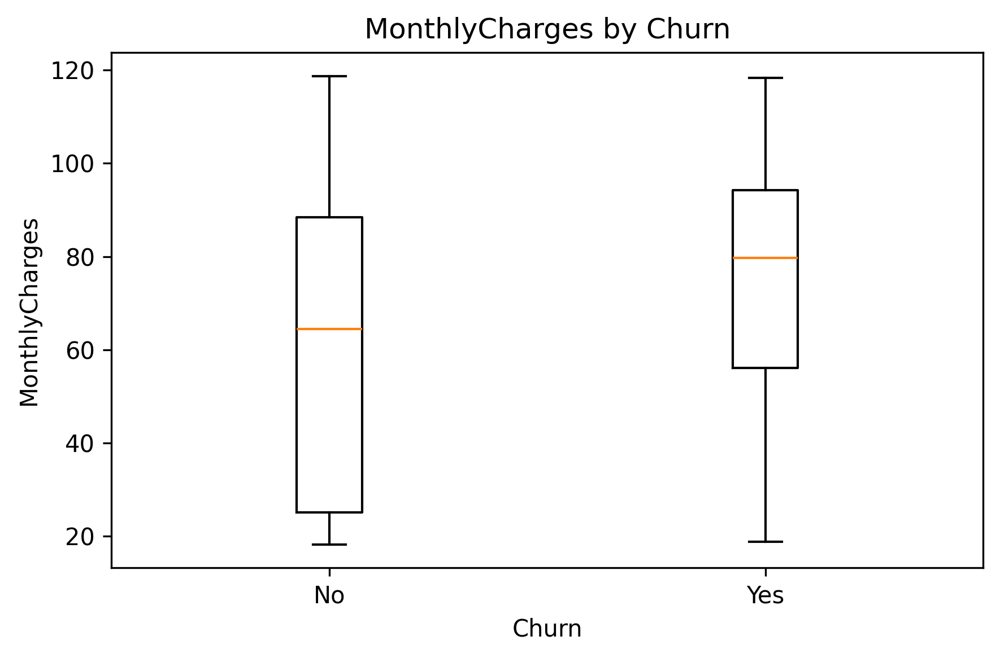
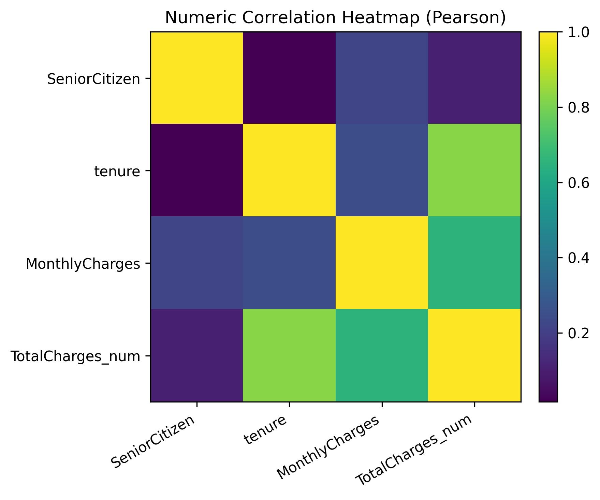
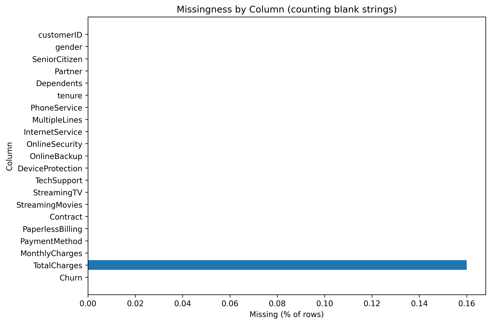
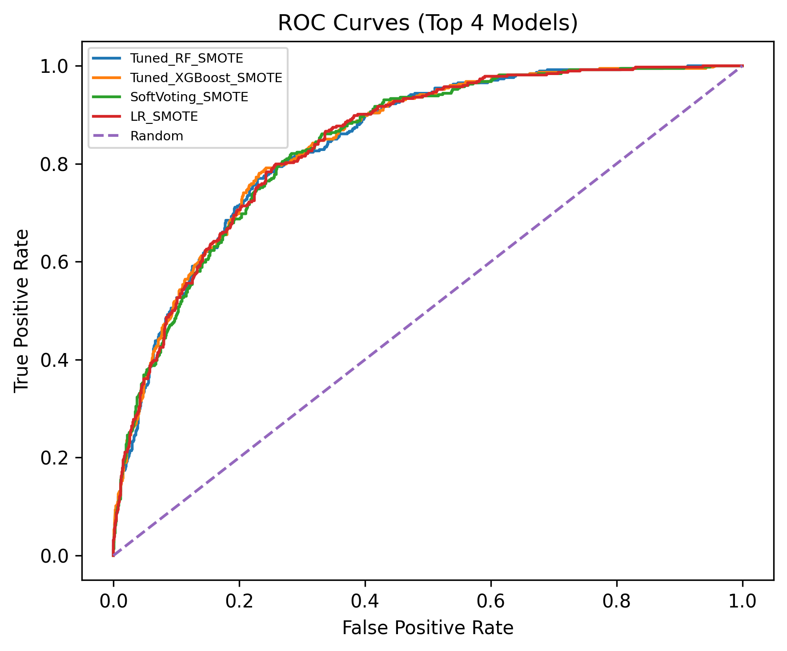
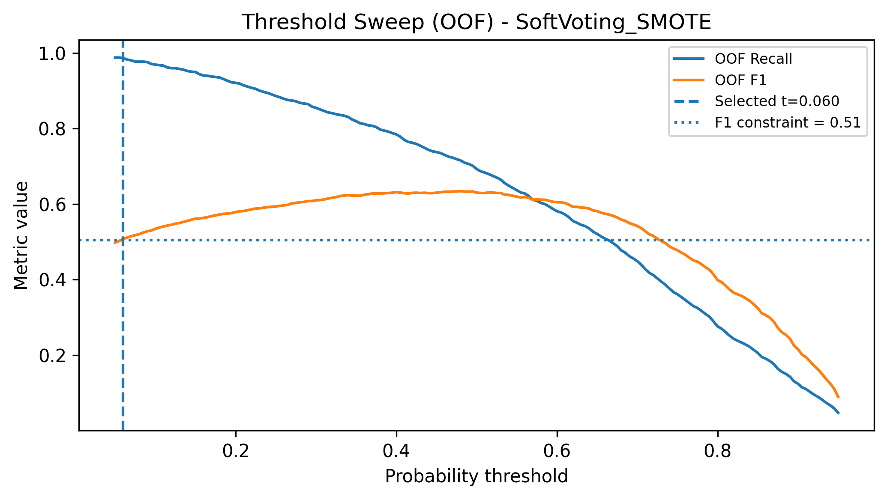
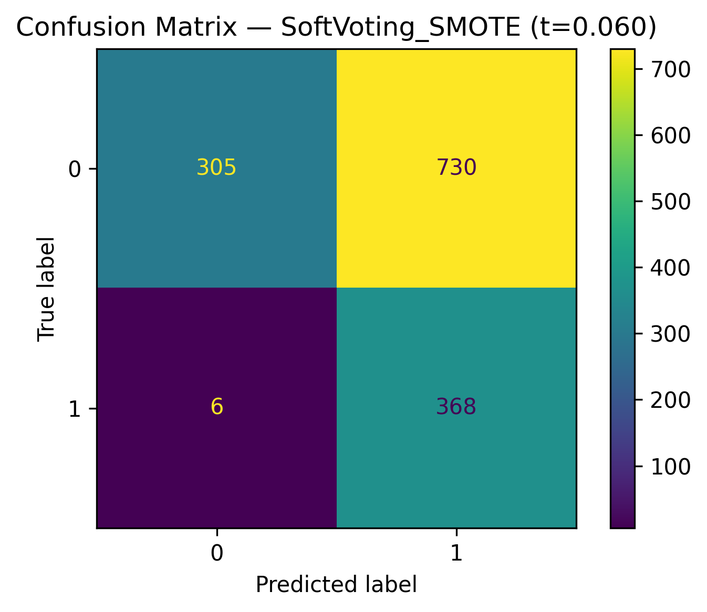
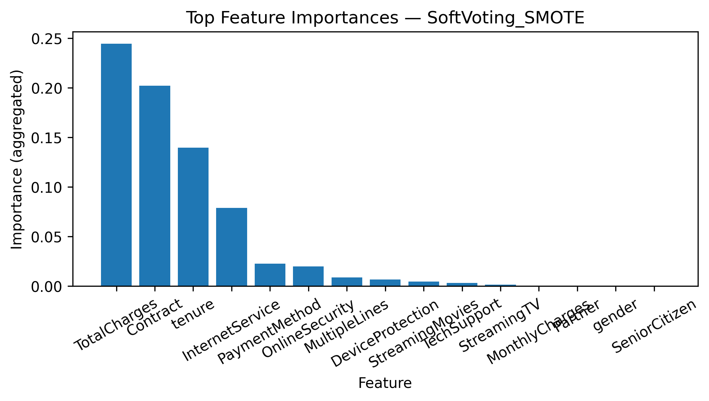

# Final Report - Telco Customer Churn Prediction (Binary Classification)

## 1) Objective
Predict **customer churn (Churn=Yes)** for a telecom dataset, with a primary focus on maximizing **Recall for Churn=1**, while also reporting standard classification metrics and ensuring a leakage-safe ML workflow.

---

## 2) Data description and setup
- **Dataset:** Telco Customer Churn (Kaggle “blastchar” version).
- **Target:** `Churn` (mapped to **0 = No**, **1 = Yes** for modeling and metrics).
- **Excluded identifier:** `customerID` is removed from predictors.
- **Train/Test split:** stratified hold-out test set (20%) with fixed random seed.
- **Artifacts created by the notebook:**
  - Cleaned dataset saved to: `./data/processed/processed_telco_clean.csv`
  - Figures saved to: `./figures/` (all plots)
  - Model artifacts saved to: `./models/` (best pipeline)

---

## 4) Phase 1 - Exploratory Data Analysis (EDA)

### 4.1 Data understanding
- The dataset contains the standard Telco churn feature set (demographics, services, contract, billing, charges).
- **Overall churn rate:** **26.54%** (meaning the positive class is the minority and motivates imbalance handling later).

### 4.2 Univariate analysis (key takeaways)
- **tenure:** right-skewed with many customers at lower tenure.
- **MonthlyCharges:** broad spread (important because churn is often associated with high monthly cost).
- **TotalCharges:** initially read as string and requires numeric correction (handled in Phase 2).

### 4.3 Bivariate analysis and correlation
**Numeric group differences (median comparisons, Churn=Yes vs No):**
- **tenure:** Median(No)=**38.00**, Median(Yes)=**10.00** → churners have **~28 months lower tenure**.
- **MonthlyCharges:** Median(No)=**64.43**, Median(Yes)=**79.65** → churners pay **~15.22** more per month.
- **TotalCharges:** Median(No)=**1683.60**, Median(Yes)=**703.55** → churners have **~980.05 lower** accumulated charges (consistent with shorter tenure).

**Strongest numeric correlations (Pearson):**
- `tenure` vs `TotalCharges_num`: **0.826** (strong - accumulated cost is largely a function of tenure).
- `MonthlyCharges` vs `TotalCharges_num`: **0.651** (moderate/strong - higher monthly cost increases total).
- `tenure` vs `MonthlyCharges`: **0.248** (weak/moderate - monthly cost is not purely driven by tenure).

**Interpretation:** Churn is strongly behavior-linked to **short tenure**, **higher monthly charges**, and contract/billing patterns (confirmed later by feature selection + importance).

**Categorical group differences (churn-rate by category):**
- **PaymentMethod:** Highest-churn subgroup is **Electronic check** with **45.3%** churn.
- **Contract:** Highest-churn subgroup is **Month-to-month** with **42.7%** churn (much higher than longer contracts).
- **InternetService:** Highest-churn subgroup is **Fiber optic** with **41.9%** churn.
- **OnlineSecurity:** Highest-churn subgroup is **No** with **41.8%** churn.
- **TechSupport:** Highest-churn subgroup is **No** with **41.6%** churn.
- **PaperlessBilling:** Highest-churn subgroup is **Yes** with **33.6%** churn.

**Interpretation:** Categorical drivers strongly align with churn risk: **billing/payment friction (Electronic check)**, **low commitment (month-to-month contracts)**, and **lack of support/security add-ons** correspond to the highest churn rates. These categories are both predictive features and direct levers for retention interventions.

---

## 5) Phase 2 - Preprocessing

### 5.1 Missing values and type fixing
**Observed missingness:**
- `TotalCharges` contains **11 blank-string missing values** (not NaN initially), representing **0.16%** of rows.

**Cleaning strategy implemented:**
1. Convert `TotalCharges` to numeric (coercing blank strings to NaN).
2. **Domain-informed correction:** if `tenure == 0`, then set `TotalCharges = 0` (a new customer should not have accumulated charges).
3. For any remaining missing numeric values, use **median imputation** inside the pipeline.

### 5.2 Encoding and scaling
- **Numeric:** `SeniorCitizen, tenure, MonthlyCharges, TotalCharges` (plus engineered numeric features in Phase 3) are imputed and scaled via **MinMaxScaler**.
- **Binary categorical:** label/ordinal encoding for binary columns.
- **Multi-class categorical:** one-hot encoding.
- **Leakage prevention:** all transformations are fit **only on training folds** via `Pipeline` + `ColumnTransformer`.

---

## 6) Phase 3 - Feature Engineering & Selection

### 6.1 Feature engineering
Four engineered features were created:
1. **ChargesPerTenure**: `MonthlyCharges / (tenure + 1)`  
2. **StreamingCount**: count of streaming services subscribed (TV + Movies)
3. **SupportSecurityCount**: count of support/security add-ons (TechSupport/OnlineSecurity/etc.)
4. **TenureGroup**: binned tenure to capture non-linear churn effects

**Why these help:** they encode **price intensity**, **bundling intensity**, **service dependence / protection**, and **non-linear tenure behavior**.

### 6.2 Feature selection (filter + model-based + stability)
Methods used:
- **Chi-Squared** (filter, suitable with non-negative transformed features)
- **L1 LogisticRegressionCV (Lasso-style)**
- **RandomForest importances**

**Final rule (explicit):** choose features appearing in $\scriptsize\ge$ **2** of the methods’ **top-15**, then fill to **15** features by best average rank.

**Final selected base features (n=15):**
- Contract, tenure, InternetService, TenureGroup, PaymentMethod, DeviceProtection, TotalCharges, ChargesPerTenure, OnlineSecurity, MonthlyCharges, TechSupport, StreamingMovies, OnlineBackup, StreamingTV, MultipleLines.

**Stability evidence (RF top-10 frequency across 5 folds):**
- Highly stable (appears in all 5 folds’ top-10): **Contract, tenure, InternetService, TenureGroup, PaymentMethod, TotalCharges, ChargesPerTenure, OnlineSecurity, MonthlyCharges, TechSupport**.
- Less stable (0/5 folds top-10): **DeviceProtection, StreamingMovies, OnlineBackup, StreamingTV, MultipleLines**.

**Modeling feature space size after preprocessing:** **39 transformed features**.

---

## 7) Phase 4 - Modeling & Optimization

### 7.1 Handle class imbalance (SMOTE vs class weights)
Leakage-safe CV comparison for **two models**:

- **Logistic Regression:** SMOTE and class weights are similar; class weights slightly higher recall (**0.790**) than SMOTE (**0.780**) but slightly lower accuracy.
- **Random Forest:** **SMOTE clearly improves recall** (**0.576**) relative to class weights (**0.487**).

**Conclusion:** For tree-based models, SMOTE provided the more reliable recall lift; LR is competitive with either strategy.

### 7.2 Baseline models (CV)
All baselines were evaluated with the same leakage-safe pipeline (including SMOTE):
- **Logistic Regression:** Recall **0.780 ± 0.026**
- **SVM (RBF):** Recall **0.722 ± 0.027**
- **Random Forest:** Recall **0.576 ± 0.026**
- **XGBoost:** Recall **0.671 ± 0.026**

**Takeaway:** LR is the strongest baseline for recall under consistent preprocessing, while XGBoost provides stronger global discrimination (confirmed by ROC-AUC later).

### 7.3 Ensembling (Soft Voting)
Soft voting (LR + RF + XGBoost) achieved:
- Recall **0.693 ± 0.036**, F1 **0.630 ± 0.025**.

This ensemble is a strong candidate for probability threshold tuning.

### 7.4 Hyperparameter tuning (RandomizedSearchCV, 2 models)
Tuned for CV Recall:
- **Random Forest:** best CV Recall **0.777**
- **XGBoost:** best CV Recall **0.729**

### 7.5 Advanced validation (10-fold Stratified CV)
Mean±std Recall (selected candidates):
- **LR_SMOTE:** **0.787 ± 0.028**
- **Tuned_RF_SMOTE:** **0.777 ± 0.035**
- **Tuned_XGBoost_SMOTE:** **0.736 ± 0.029**
- **SoftVoting_SMOTE:** **0.701 ± 0.027**
- (others lower)

---

## 8) Phase 5 - Final evaluation & reporting

### 8.1 Metrics table (test set, threshold=0.5 snapshot)
On the held-out test set at the default 0.5 threshold, the top Recall models were:
- **LR_SMOTE:** Recall **0.799**, F1 **0.627**
- **Tuned_RF_SMOTE:** Recall **0.783**, F1 **0.631**
- **Tuned_XGBoost_SMOTE:** Recall **0.746**, F1 **0.638**
- **SoftVoting_SMOTE:** Recall **0.679**, F1 **0.616**

### 8.2 ROC-AUC comparison (top 4)
Top models are tightly grouped by ROC-AUC:
- Tuned_XGBoost_SMOTE: **0.844**
- LR_SMOTE: **0.843**
- Tuned_RF_SMOTE: **0.842**
- SoftVoting_SMOTE: **0.841**

**Interpretation:** These models have very similar ranking ability, so final performance is primarily driven by threshold choice and precision/recall trade-offs.

### 8.3 Final analysis: winner selection under recall-maximization constraint
**Goal:** maximize **Recall (Churn=1)** subject to **F1 ≥ 0.50**.

**Leakage-safe selection method:**
- For multiple strong candidates (LR_SMOTE, Tuned_RF_SMOTE, Tuned_XGBoost_SMOTE, SoftVoting_SMOTE), compute **OOF probabilities** on *training only* and sweep thresholds.
- To reduce risk of failing the constraint on the test set, the constraint was strengthened from **min_f1 = 0.50** to **min_f1 = 0.51** during model selection.
- Under this stricter constraint, the chosen winner was:

> **Winner:** SoftVoting_SMOTE at **threshold = 0.060**  
> **OOF Recall = 0.987**, **OOF F1 = 0.508**

**Test set performance at the selected threshold (t=0.060):**
- **Recall:** 0.984  
- **F1:** 0.500 (This is an exact equality and there is no rounding difference.)
- **Precision:** 0.335  
- **Accuracy:** 0.478

**Error analysis (confusion matrix pattern):**
- This very low threshold achieves extremely high recall by labeling many customers as churn, producing many **false positives** (higher retention cost), while producing very few **false negatives** (missed churners).

**Most important drivers (aggregated importances for the winner):**
1. **TotalCharges** (0.244)
2. **Contract** (0.202)
3. **tenure** (0.140)
4. **InternetService** (0.079)
5. **PaymentMethod** (0.022)
6. **OnlineSecurity** (0.020)
(others smaller)

**Interpretation:** churn risk is dominated by **contract/tenure economics** and **billing/service structure**, not demographics.

---

## Actionable recommendations
1. **Contract conversion (highest impact):** Month-to-month customers churn at **42.7%**. Offer contract-upgrade incentives (12–24 month discounts, perks, bundled services) to reduce churn through stronger commitment.
2. **Early lifecycle retention:** Churners have median tenure **10 months** vs **38 months** for non-churners. Focus retention interventions in the first months (onboarding, welcome calls, proactive issue resolution).
3. **Pricing/value optimization:** MonthlyCharges is higher for churners (median **79.65** vs **64.43**). For high-charge customers, offer plan right-sizing, bundles, or temporary relief to improve perceived value.
4. **Payment method improvement:** Electronic check customers have the highest churn (**45.3%**). Encourage autopay/bank transfer and simplify billing; even small incentives can reduce churn associated with payment friction.
5. **Support/security bundling:** Lack of OnlineSecurity (**41.8% churn**) and TechSupport (**41.6% churn**) is strongly associated with churn. Provide free trials or discounted bundles for high-risk segments.
6. **Fiber optic segment focus:** Fiber optic churn is high (**41.9%**). Improve service reliability/support experience and target this segment with tailored retention offers.
7. **Deployment strategy:** The selected threshold is recall-first, so false positives are expected. Use a **tiered churn-risk queue** to match intervention cost to predicted risk (cheap nudges for medium risk; stronger offers for top risk). This reduces wasted incentive spend while preserving the recall-first objective.
